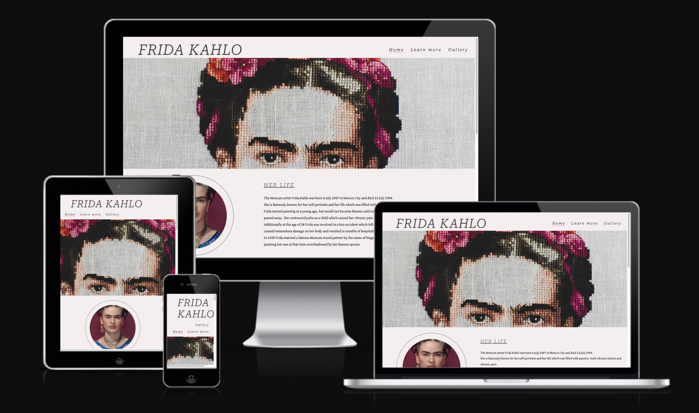
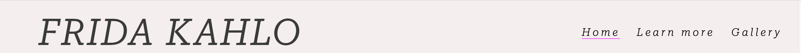
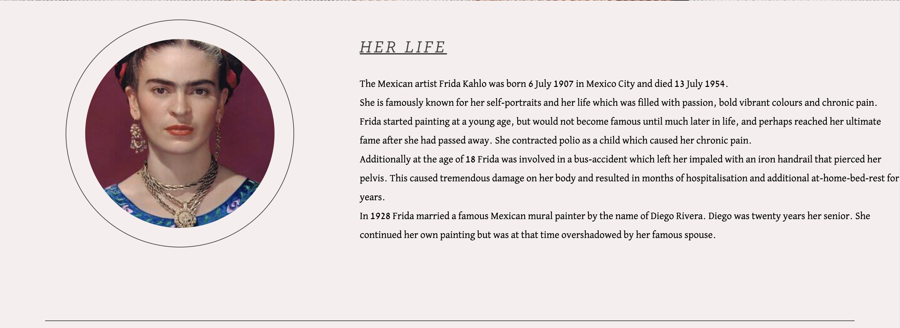
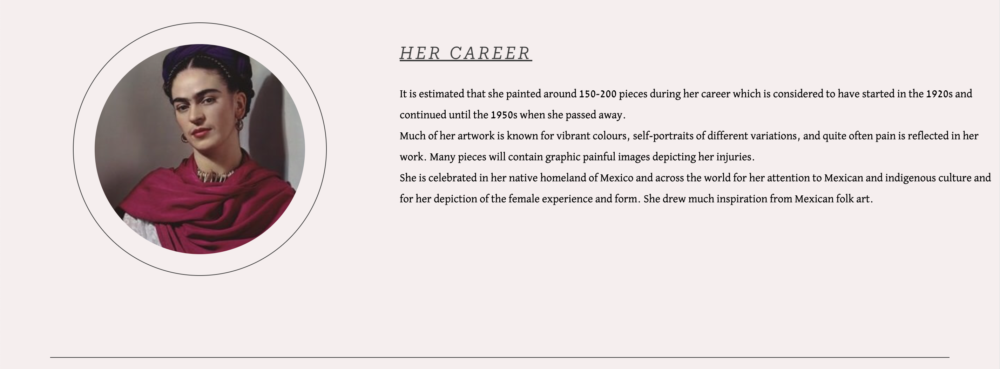
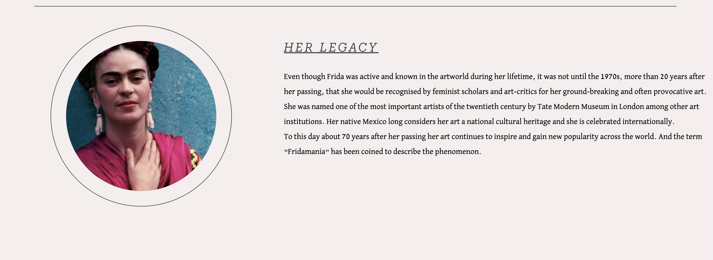
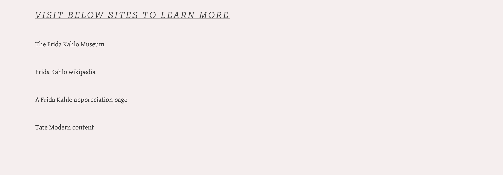

# Frida Kahlo

This website is about the historical Mexican artist Frida Kahlo. Famous globally for her art as well as her lifestory. The website's intention is to give a brief introduction to the artist and show selected pieces from her portfolio. Additionally it links to further resources for the user to gain more knowledge. The Frida Kahlo website, will be targeted against, and is useful for, art lovers who are curious about Frida Kahlo and would like a short introduction.

# Features

## Existing Features

### Navigation Bar
Featured on all three pages, the full responsive navigation bar includes links to the Logo on the left, and Home page, Learn More and Gallery on the right and is identical on all pages to allow for easy navigation.
This section will allow the user to easily navigate from page to page across all devices without having to revert back to the previous page via the ‘back’ button.

### The landing page image
The landing includes a photograph showing the top half of the artists face as an eye catching, artistic image to grab the users attention. 

### Her Life/Her Career/Her Legacy
The three home page information sections summarise selected information about the artists lifestory in three identically styled sections, with the exception of image content, and the additon of a thin line to separate the content.  This showcases the websites main informational content on the homepage for easy access to the main information required by the user.

### The Footer
The footer section includes links to the relevant social media sites for Frida Kahlo. The links will open to a new tab to allow easy navigation for the user. Additionally there is a link to contact the website owner via email. Below copyright information has been added. 
The footer is valuable to the user as it encourages them to keep connected via social media.
The footer is repeated in identical format across all three pages for repetition and easy access.
 

### Learn more
The Learn more page has identical navigation bar, landing page-image and footer for repetition and familiarity.
<!--Insert here a screen shot of whole page, see example CIS -->

### Additional resources
The section includes four clickable links to external websites (all opening in a new tab). The purpose of this section is for the user to continue to seek further information as well as verify the summarised facts presented on the current website.

### Gallery
The Gallery page repeats the navigation bar and footer from previous pages. Additionally it contains a simple image gallery showcasing selected pieces of the artists work. This section is valuable for the user to get an initial understanding of the artists style.
 

## Features Left to Implement

### Home
Add more information paragraphs to provide further details about the artist. 

### Learn more
Add more external links and improve styling.

### Gallery
Add information and external links about the artwork as well as more styling. 

## Testing

The website has been tested independently and through external resources.
All internal navigation links across all three pages have been verified and function well.
All external links in the footer have been verified and function well. Additionally they all open in a new tab.
All external links on the Learn More page have been verified and function well.
Mentor feedback was received on two occasions which resulted in small styling changes to improve the user experience. 

## Validator Testing

#### HTML
No errors were found when passing through the official W3C validator

#### CSS
No errors were found when passing through the official (Jigsaw) validator

### Unfixed Bugs
No known bugs at time of deployment.

### Fixed Bugs

####Pre-Deployment
Multiple minor styling errors were fixed before deployment.

####Post-Deployment

<!--In this section, you need to convince the assessor that you have conducted enough testing to legitimately believe that the site works well. Essentially, in this part you will want to go over all of your project’s features and ensure that they all work as intended, with the project providing an easy and straightforward way for the users to achieve their goals.

In addition, you should mention in this section how your project looks and works on different browsers and screen sizes.

You should also mention in this section any interesting bugs or problems you discovered during your testing, even if you haven't addressed them yet.

If this section grows too long, you may want to split it off into a separate file and link to it from here.

Unfixed Bugs
You will need to mention unfixed bugs and why they were not fixed. This section should include shortcomings of the frameworks or technologies used. Although time can be a big variable to consider, paucity of time and difficulty understanding implementation is not a valid reason to leave bugs unfixed.-->

example link

[google.com](https://google.com)

Link to live page

 https://josefinlarsson.github.io/frida-kahlo/

