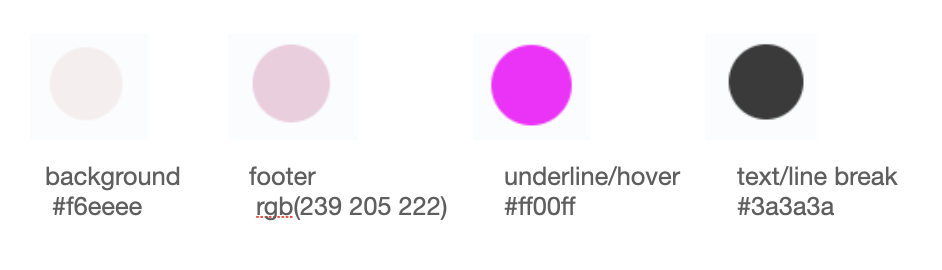
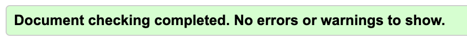
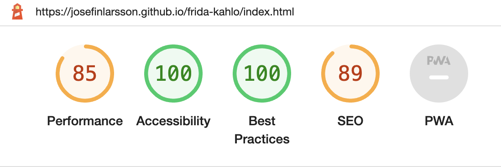
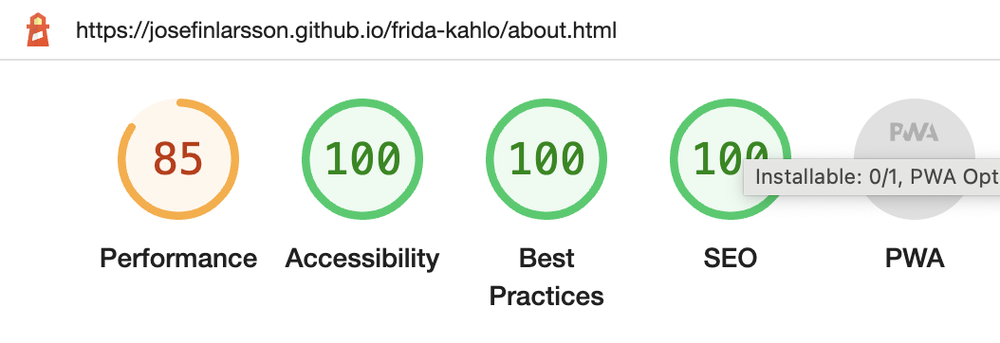
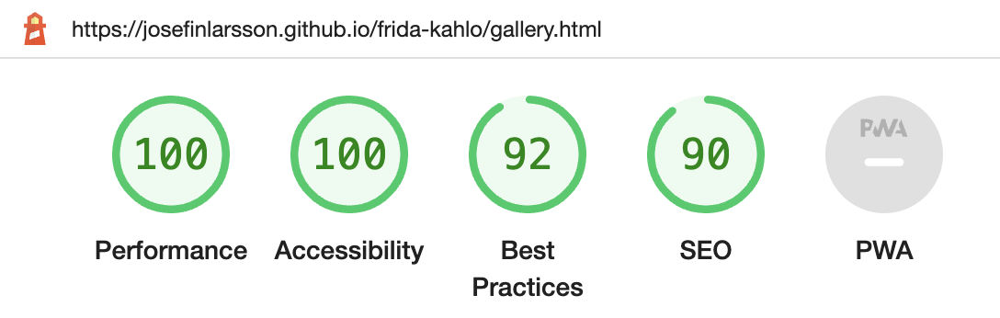
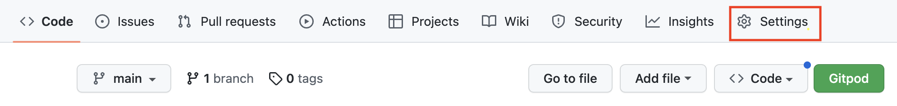
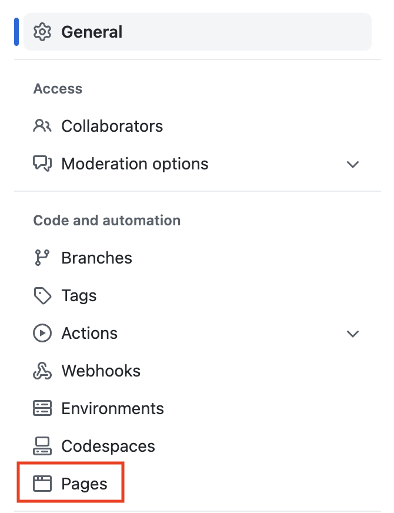
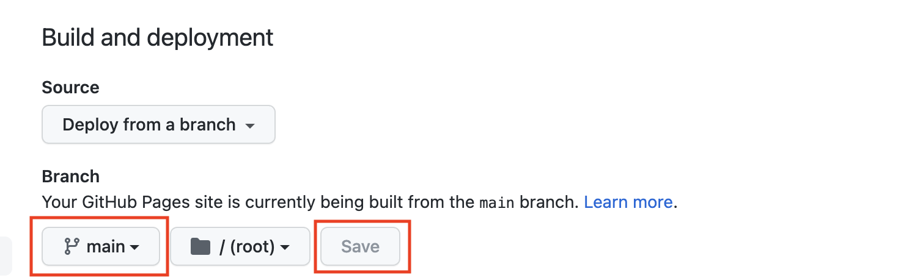
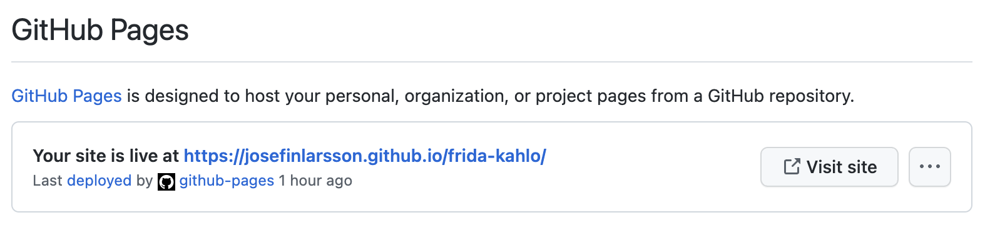

# Frida Kahlo

The website is about the historical Mexican artist Frida Kahlo. Famous globally for her art as well as her lifestory. The website's intention is to give a brief introduction to the artist and show selected pieces from her portfolio. Additionally it links to further resources for the user to gain more knowledge. The Frida Kahlo website, will be targeted against, and is useful for, art lovers who are curious about Frida Kahlo and would like a short introduction.

# Project Goal
To show the developers ability to build a responsive website using HTML and CSS only.

# User

## Target Audience
<li>People who have heard about Frida Kahlo and are interested to view a short introductory website.</li>

# Features

## Existing Features

### Navigation Bar
<li>Featured on all three pages, the full responsive navigation bar includes links to the Logo on the left, and Home page, Learn More and Gallery on the right and is identical on all pages to allow for easy navigation.
This section will allow the user to easily navigate from page to page across all devices without having to revert back to the previous page via the ‘back’ button.</li>

### The landing page image
<li>The landing includes a photograph showing the top half of the artists face as an eye catching, artistic image to grab the users attention.</li> 

### Her Life/Her Career/Her Legacy
<li>The three home page information sections summarise selected information about the artists lifestory in three identically styled sections, with the exception of image content, and the additon of a thin line to separate the sections.  This showcases the websites main informational content on the homepage for easy access to the main information required by the user.</li>

### The Footer
<li>The Footer section includes links to the relevant social media sites for Frida Kahlo. The links will open to a new tab to allow easy navigation for the user. Additionally there is a link to contact the website owner via email. Below copyright information has been added. 
The footer is valuable to the user as it encourages them to keep connected via social media.
The footer is repeated in identical format across all three pages for repetition and easy access.</li>
 

### Learn more
<li>The Learn more page has identical navigation bar, landing page-image and footer for repetition and familiarity.</li>

### Learn more - additional resources section
<li>The section includes four clickable links to external websites (all opening in a new tab). The purpose of this section is for the user to continue to seek further information as well as verify the summarised facts presented on the current website.</li>

### Gallery
<li>The Gallery page repeats the navigation bar and footer from previous pages. Additionally it contains a simple image gallery showcasing selected pieces of the artists work. This section is valuable for the user to get an initial understanding of the artists style.</li>
 

## Features Left to Implement

### Home
<li>Add more information paragraphs to provide further details about the artist.</li> 

### Learn more
<li>Add more external links, information and improve styling. Add images.</li>

### Gallery
<li>Add information and external links about the artwork as well as more styling.</li>

### Footer
<li>Add additional styling.</li>

# Design

## Colour Scheme

<li>The colour scheme was inspired by the hero image as well as the colourful art which the artist is known for.  Different shades of pink with contrasting text in a classic dark grey tone for clear contrast. The chosen colours bring a soft touch but playful yet classic feel to the website.</li>

## Typography

<ul><li>Fonts were chosen and imported from Google Fonts.</li>
<li>Headings and Logo: Roboto serif.
Other text: David Libre.</li>
<li>Both were chosen for their classic yet artistic appearance.</li></ul>

# Testing

<ul>
<li>Manual testing of internal navigation links which are verified to function well across all three pages.</li>
<li>Manual testing of external links in footer which are verified to function well and open in a new tab.</li>
<li>Manual testing of external links in Learn More page which are verified to function well and open in a new tab.</li>
<li> Mentor feedback received and changes implemented on two occassions which resulted in styling improvements and enhanced responsiveness.</li>
<li>Manual testing of code indentation and correct code formats.</li>
<li>Manual testing to verify class and id names are used accurately.</li>
</ul>

## Responsive devices
<li>#</li

 

## Validator testing

#### HTML
<li>No errors were found when passing through the official W3C validator.</li>

#### CSS
<li>No errors were found when passing through the official (Jigsaw) validator.</li>

#### LIGHT HOUSE
<li>Light House test performed with the below result.</li>

##### Home page

##### Learn More page

##### Gallery page

### Fixed Bugs
 <ul>
 <li>Repaired styling errors</li>
 <li>Repaired missing closing tags</li>
 <li>Reapired missing attributes</li>
 <li>Improved semantic mark-up by replacing some divs with sections.</li>
 <li>Improved website responsiveness to different screen resolutions.</li>
 </ul>

 ### Unfixed Bugs
<ul>
<li>#</li>
</ul>

## Technology Used

### Languages
HTML and CSS.

### Tools and libraries
<ul> 
<li>Google Fonts- to download all fonts used</li>
<li>Chrome Dev Tools - for quick testing and live preview adjustments and trouble shooting</li>
<li>Gitpod - to create and host the website.</li>
<li>Github- to deploy the website.</li>
<li>Am I Responsive - to create the image displaying the homepage on multiple devices.</li>
</ul>

## Deployment

The site was deployed to GitHub pages. The steps to deploy are as follows:
<ul>
<li>In the GitHub repository navigate to the Settings.
</li>

<li>From the left-hand menu select Pages.
</li>

<li>Under Build and deployment-Source-Branch. Select main branch and save.
</li>

<li>Wait a couple of minutes and then refresh the page.
At the top of the page your live link will be made available.
</li>
</ul>

The live link for this project can be found here - https://josefinlarsson.github.io/frida-kahlo/index.html

## Credits
<ul>
<li>General code was created from the developers own knowledge gained during Code Institute lessons on learning platform with particular focus on the "Love-Running" lesson project.</li>

 <li>Mentor-support and guidance recieved from Sandeep Aggarwal was invaluable to gain better understanding and knowledge of the process as well as insightful tips on styling and semantic formatting as well as help to prioritise.</li>

<li>Additionally research and inspiration was gained from [Stackoverflow.com](https://stackoverflow.com/) and [W3schools.com](https://www.w3schools.com/). 
 Exact Copy of code was taken from stackoverflow on one occassion and re-worked slightly into two css rules for classes .intro-hr and .footer-hr. See style.css file.</li>
 </ul>

## Content
<li>The text content is written by the web developer and not copied. But inspiration and additional facts were taken from [Wikipedia](https://en.wikipedia.org/wiki/Frida_Kahlo) and [FridaKahlo.org](https://www.fridakahlo.org)</li>

## Media
<ul>
<li>The hero-image is taken from [Pexels.com](http://www.pexels.com)</li>

<li>All other images are taken from [FridaKahlo.org](https://www.fridakahlo.org)</li>
</ul>

